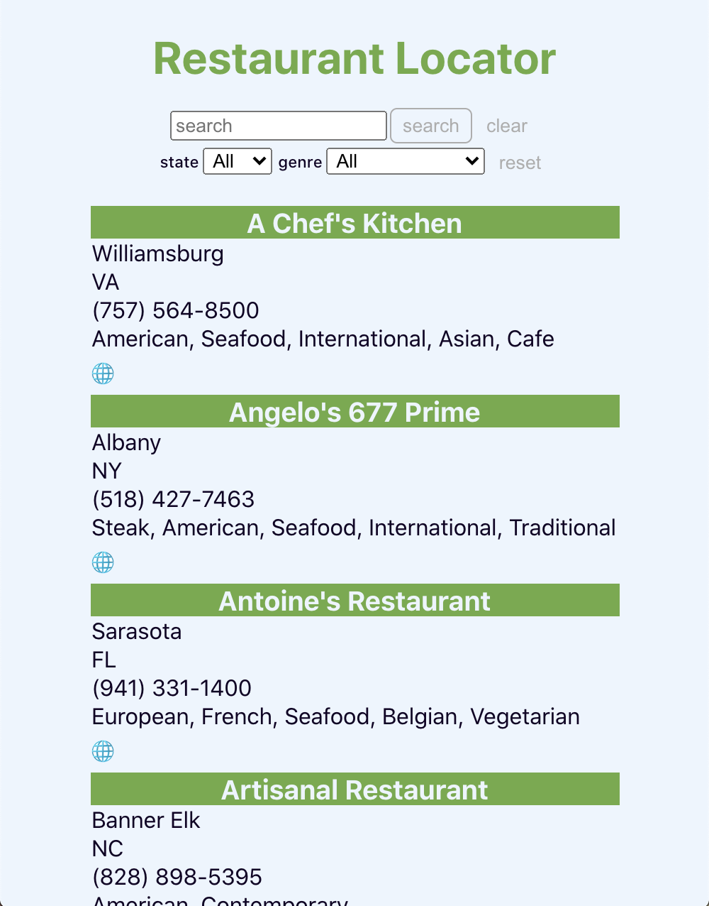
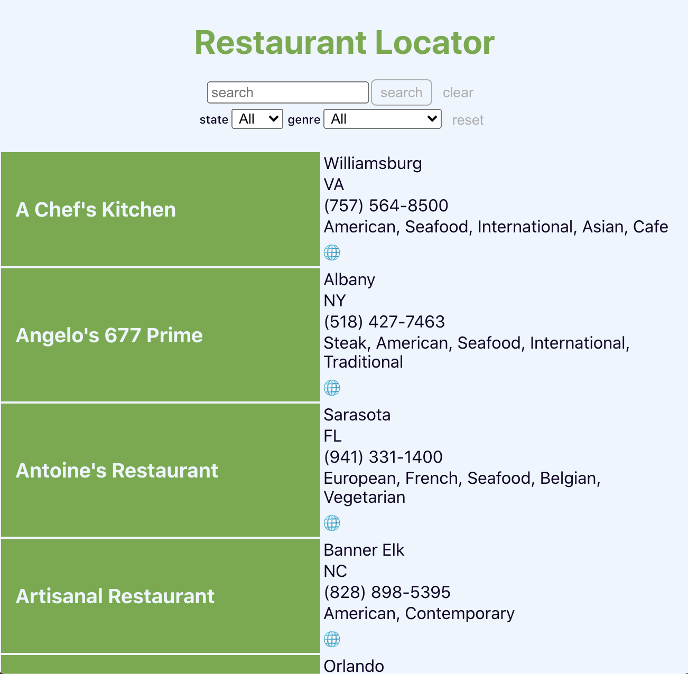

<br />
<center>
<p>
  <a href="https://github.com/GreysonElkins/list-and-filter">
    
  </a>
  <h1 style="color:#6cac44">Restaurant Locator</h1>
</p>

[![Contributors][contributors-shield]][contributors-url]
[![Forks][forks-shield]][forks-url]
[![Stargazers][stars-shield]][stars-url]
[![Issues][issues-shield]][issues-url]

<p>
  <!-- <a href="https://hire-up-turing.herokuapp.com/">View Deployed</a>
  · -->
  <a href="https://github.com/GreysonElkins/list-and-filter/issues">Report Bug</a>
  ·
  <a href="https://github.com/GreysonElkins/list-and-filter/issues">Request Feature</a>
  </p>
</center>
## Table of Contents

* [About the Project](#about-the-project)
  * [Built With](#built-with)
* [Getting Started Locally](#getting-started-locally)
  * [Installation](#local-installation)
* [Usage](#usage)
  * [The `SearchAndFilter` Component](#the-searchandfilter-component)
  * [The `List` Component](#the-list-component)
  * [Style](#style)
  * [Putting it All Together](#putting-it-all-together)
* [Roadmap](#roadmap)
* [Contributing](#contributing)
* [Contact](#contact)


<!-- ABOUT THE PROJECT -->
## About The Project

Restaurant Locator is an exercise in creating reusable List and Filter features. The example here fetches restaurant data from a code challenge API, and `App` passes that to the `SearchAndFilter` component, which can dynamically render a paginated list. 

### Built With
<center>
<a href="https://reactjs.org">
  
</a>
<br />
<a href="https://www.typescriptlang.org">
 
</a>
<br />
<a href="https://sass-lang.org">
  
</a>
</center>

<!-- GETTING STARTED Locally -->
## Getting Started Locally


### Local Installation
##### Prerequisites:
* npm: (`npm install npm@latest -g`)

1. Clone the repo
```sh
git clone git@github.com:GreysonElkins/list-and-filter.git
```
2. Install NPM packages
```sh
npm install
```
3. Navigate to `/src/components/App/App.tsx` and comment out the following code in the first `useEffect` hook
```
getRestaurants()
  .then(restaurants => {
    if (Array.isArray(restaurants)) {
      setRestaurants(restaurants)
    } else {
      setError(restaurants)
      setIsLoading(false)
    }
  })
  .then(() => {
    setIsLoading(false)
})
```
4. Place this code block in it's place
```
setRestaurants(fakeData)
setIsLoading(false)
```
5. Run the app!
```sh
npm run dev
```
6. Go to `localhost:3000` in your browser

<b>Note:</b> steps 3 and 4 allow you to run Restaurant Locator without actually accessing the API, which requires authentication not provided here.

<!-- USAGE EXAMPLES -->
## Usage

### The `SearchAndFilter` Component

The `SearchAndFilter` (and it's child, the `List` component) were designed to be useful for displaying any set of data and has customizable and some required properties. 

Restaurant Locator's `SearchAndFilter` looks as such: 
```
<SearchAndFilter 
  allData={restaurants} 
  columns={['name', 'city', 'state', 'telephone', 'genre', 'website']}
  filterTypes={['state', 'genre']}
  loadingIcon={loadingIcon}
/>
```
1. `allData` is a **required prop** which should include all of the data you'd like to display on the list, if not more (we're working towards making any data searchable via the text-input). This data should be an **array of objects** with unique string IDs.

  * read more about the specifics of this prop in [`listItems`](#the-list-component), `SearchAndFilter` passes either `allData` or search results to `List` as the `listItems` prop

2. `columns` is also **required**. This is passed to `List` as the instructions for which data you'd like to display. It should be an **array of strings** that *correlate with key-names* of the objects provided by `allData`

3. `filterTypes` is an **optional prop**. It should also be an **array of strings** that *correlate with key-names* of the objects provided by `allData`, and for each item entered here a drop-down will be created with all possible values for the provided key-name. These are the filters a user can use to search the data. 

    * It is suggested that any data which has multiple tags, (or in our example, `genres`) to be filtered through, that these values be stored as an array. For example: 

```
const allData = [ ...,
  {
    "id": "f223fdd0-4adc-423e-9747-980a66c256ca",
    "name": "Old Hickory Steakhouse",
    "city": "Oxon Hill",
    "state": "MD",
    "zip": "20745",
    "telephone": "(301) 965-4000",
    "website": "http://www.gaylordnational.com",
    "genre": ["Steak", "American", "Contemporary", "Seafood", "Cafe"],
    "hours": "Open Daily 5:30 PM-10:00 PM",
    "attire": "business casual"
  }, ...
]
```

4. `loadingIcon` is an **optional prop** which allows for an image to appear while the search is running. In our case, the `loadingIcon` was imported at the top of `App`.
This should also be able to accept a string file-path from the image to the `SearchAndFilter` component. 

### The `List` Component

`listItem` objects should have a unique string ID and can contain values that are numbers, booleans, strings, and arrays. Before being added to the table, each value will be translated into a string. The `List` also has a limited ability to recognize when a URL has been entered and replace it with an anchor tag and "🌐" icon.

`List` will paginate its contents into groups of ten. 

The `List` is automatically rendered by `SearchAndFilter`, but can be used independently as well. It *requires two props*: 

1. `listItems` expects an **array of objects** that will be displayed on the table. 

2. `columns` should be an **array of strings** that *correlate with key-names* of the objects provided by `listItems`. The included items will determine what data to display as part of the list, and their column title. 

### Style

`List` and `SearchAndFilter` utilize Sass in order to provide an easy method of changing branding and style in other uses. Both components' corresponding `.scss` files import `variables.scss` from source, which includes these variables.

```
$background: #ecf5fe;
$text: #110226;
$faded-text: #adadad;

$accent-one:#6cac44;
$accent-two: #6fd9ac;
$accent-three: #cae3fc;
$accent-four: #0C70D4;
$error: #590e35;
```

### Putting it All Together

The user is able to combine multiple filters with a search input. If no results are found, the list will return to its full view and display a message to the user. (In this case, we see that a User searches for items in Massachusetts that contain the word "chef" and finds nothing, but when removing the state filter, "A Chef's Kitchen" in Vermont is shown.)

<center>

</center>
These components are built with responsive layouts in mind: 

#### On a Phone:
<center>
  
</center>

#### On A Tablet: 
<center>


</center>

<!-- ### Search for and message users:
 

### Sign up as an applicant:
 

### View your messages as an applicant:
  -->

<!-- ROADMAP -->
## Roadmap

See the [open issues](https://github.com/GreysonElkins/list-and-filter/issues) for a list of proposed features (and known issues).

<!-- CONTRIBUTING -->
## Contributing

Contributions are what make the open source community such an amazing place to be learn, inspire, and create. Any contributions you make are **greatly appreciated**.

1. Fork the Project
2. Create your Feature Branch (`git checkout -b feature/AmazingFeature`)
3. Commit your Changes (`git commit -m 'Add some AmazingFeature'`)
4. Push to the Branch (`git push origin feature/AmazingFeature`)
5. Open a Pull Request

<!-- CONTACT -->
## Contact

[Greyson Elkins](https://www.linkedin.com/in/greyson-elkins/) - greysonelkins@gmail.com  

<!-- MARKDOWN LINKS & IMAGES -->
<!-- https://www.markdownguide.org/basic-syntax/#reference-style-links -->
[contributors-shield]: https://img.shields.io/github/contributors/GreysonElkins/list-and-filter.svg?style=flat-square
[contributors-url]: https://github.com/GreysonElkins/list-and-filter/graphs/contributors
[forks-shield]: https://img.shields.io/github/forks/GreysonElkins/list-and-filter.svg?style=flat-square
[forks-url]: https://github.com/GreysonElkins/list-and-filter/network/members
[stars-shield]: https://img.shields.io/github/stars/GreysonElkins/list-and-filter.svg?style=flat-square
[stars-url]: https://github.com/GreysonElkins/list-and-filter/stargazers
[issues-shield]: https://img.shields.io/github/issues/GreysonElkins/list-and-filter.svg?style=flat-square
[issues-url]: https://github.com/GreysonElkins/list-and-filter/issues
[license-shield]: https://img.shields.io/github/license/GreysonElkins/list-and-filter.svg?style=flat-square
